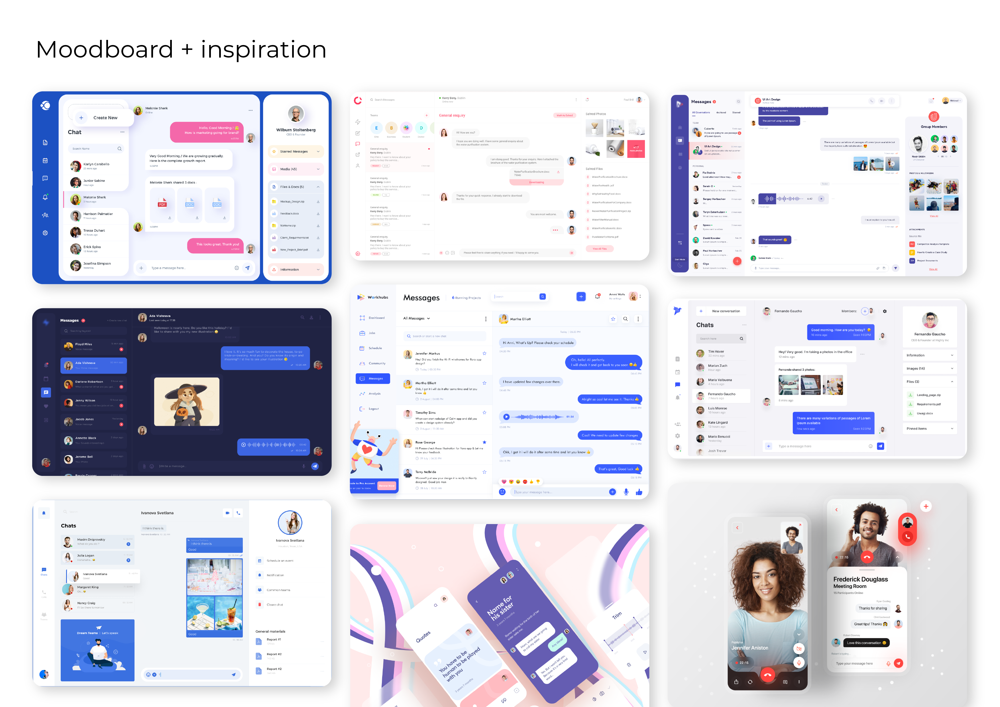
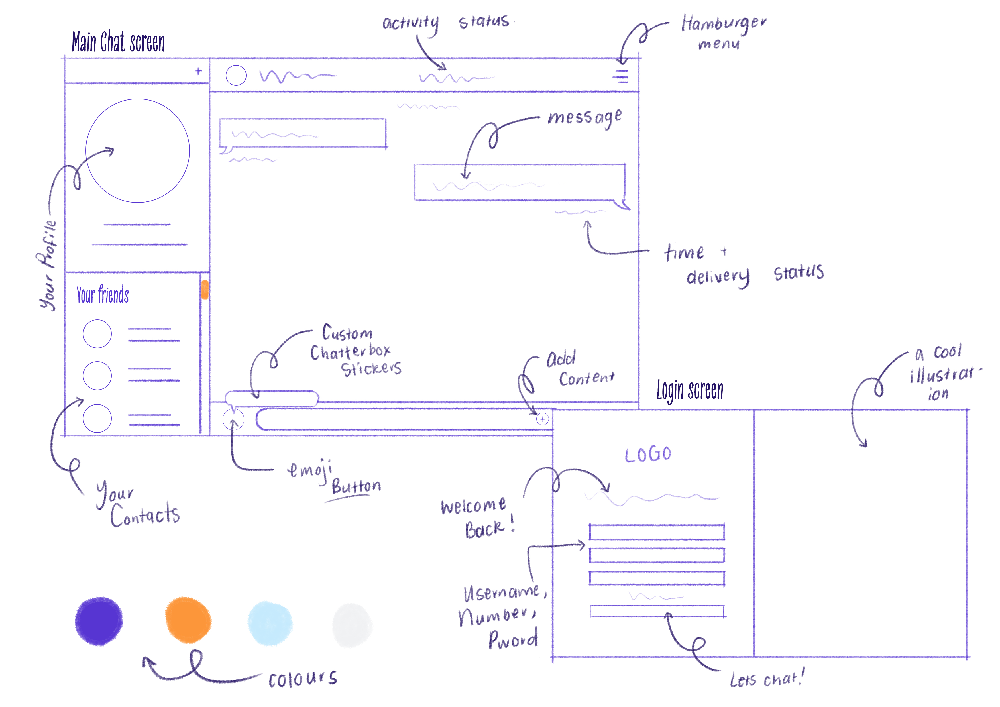
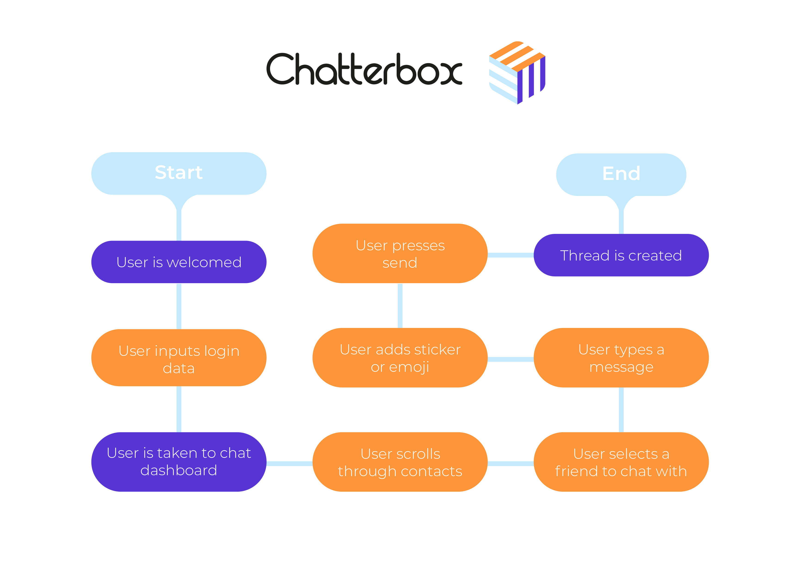
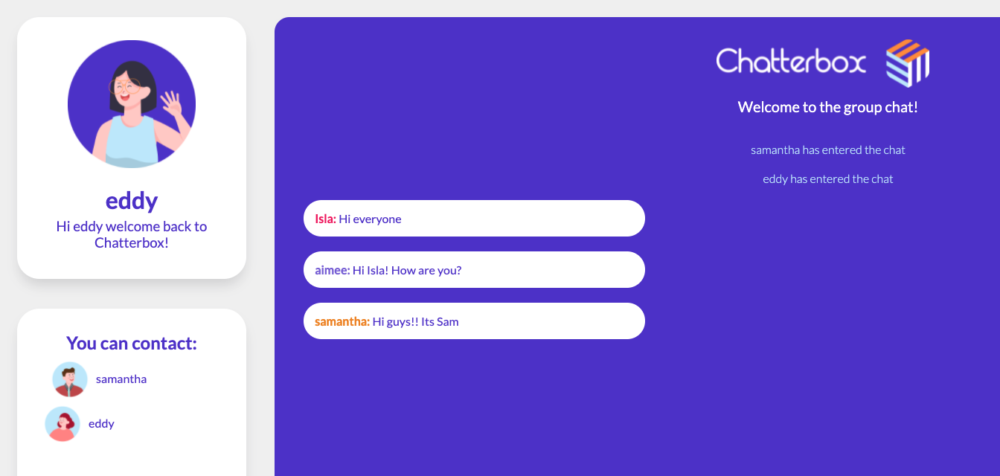

[![Contributors][contributors-shield]][contributors-url]
[![Forks][forks-shield]][forks-url]
[![Stargazers][stars-shield]][stars-url]
[![https://github.com/isla-just/chatterbox/issues][issues-shield]][issues-url]
[![MIT License][license-shield]][license-url]
[![https://www.linkedin.com/in/isla-just-b038a2202/][linkedin-shield]][linkedin-url]
<!--fix these links-->


<!-- PROJECT LOGO -->
<br />
<p align="center">
  <a href="https://github.com/isla-just/chatterbox">
    
  </a>

  <p align="center">
    A fun and interactive chatroom done with Node.js and socket.io
    <br />
    <a href="https://github.com/isla-just/chatterbox"><strong>Explore the docs »</strong></a>
    <br />
    <br />
    <a href="https://github.com/isla-just/chatterbox">View Demo</a>
    <!--insert demo video-->
    ·
    <a href="https://github.com/isla-just/chatterbox/issues">Report Bug</a>
    ·
    <a href="https://github.com/isla-just/chatterbox/issues">Request Feature</a>
  </p>
</p>


<br></br>
<!-- TABLE OF CONTENTS -->
<details open="open">
  <summary><h1 style="display: inline-block">Table of Contents</h1></summary>
  <ol>
    <li>
      <a href="#about-the-project">About The Project</a>
      <ul>
        <li><a href="#built-with">Built With</a></li>
      </ul>
    </li>
    <li>
      <a href="#getting-started">Getting Started</a>
      <ul>
        <li><a href="#prerequisites">Prerequisites</a></li>
        <li><a href="#installation">Installation</a></li>
      </ul>
    </li>
    <li><a href="#functions">Features and functions</a></li>
    <li><a href="#concept">Concept process</a>
          <ul>
        <li><a href="#ideation">Ideation</a></li>
        <li><a href="#wireframes">Wireframes</a></li>
        <li><a href="#userflow">User-flow diagram</a></li>
      </ul>
    </li>
     <li><a href="#dev">Development process - implementation</a></li>
      <li><a href="#demo">Demo video</a></li>
    <li><a href="#Contributions">Contributions</a></li>
    <li><a href="#license">License</a></li>
    <li><a href="#contact">Contact</a></li>
    <li><a href="#acknowledgements">Acknowledgements</a></li>
  </ol>
</details>


<!-- ABOUT THE PROJECT -->
<br></br>

# About The Project

  

<br></br>

## Built With

* [https://nodejs.org/en/](node.js)
* [https://socket.io/](socket.io)
* [https://www.javascript.com/](javascript)

<br></br>
<!-- GETTING STARTED -->
# Getting Started

To run a local copy of Chatterbox follow these simple steps:

## Prerequisites

* install Node.js [https://nodejs.org/en/](node.js) and follow the installation instructions

* homebrew
  ```sh
  brew install node
  brew install npm 
  ```

* npm
  ```sh
  npm install
  npm init --yes
  ```

### Installation

1. Clone the repo
   ```sh
   git clone https://github.com/isla-just/chatterbox.git
   ```
2. Install NPM packages - client.js
   ```sh
   npm install --save es6-template-strings
   npm install socket.io-client
   npm install node-static

   ```

3. Install NPM packages - server.js
   ```sh
   npm install --save es6-template-strings
   npm install socket.io

   ```

<br></br>

# Features and functions 
This is a chatroom website that allows multiple users (clients) to login to the chatroom and send messages through the server. Each client will see all the other client's messages - functioning as an interactive groupchat. 

The user can login with aithentication, be welcomed to their chatterbox profile, view a list of the users online currently available to chat, send a message and communicate with other users. 

See the [open issues](https://github.com/isla-just/chatterbox/issues) for a list of proposed features (and known issues).

<br></br>

# Concept process
### Ideation
For this project I started off with coming up with my brand. I desgned a logo and put together a colour palette. I also started looking at some inspiration images. Here is the moodboard I put together:


  
<br></br>

### Wireframes

It was then time to start designing and planning the layout of my chatroom website. Here are some sketched wireframes that I drew:
  

  I ended up changing this design quite a lot - I changed the tiled layout into rounded cards
<br></br>

### User-flow diagram
Next, I did a simple userflow diagram that maps out the basic flow of information as the user interacts with the website 
  
<br></br>

# Development process and implementation
Roadmap of my progress and struggles over the last 9 weeks
* **login page** - The first step of my development process involved creating a simple welcoming response after the HTTP request was sent. I also focussed on styling in this phase
* **Routing and templates** - We then learned how to implement routing in our projects so I could start implementing my chat page. We also learned how to read HTML files and use them as templates
* **Socket.io** - I had a bit of a rocky start with socket.io but I managed to implement the communication between the client and server and to have multiple clients connected
* **Sending messages** - Next we learned how to write to text files to store chat history. This was where I started to format my responses nicely and output the messages

<!-- USAGE EXAMPLES -->
## Usage

This project could be built upon by adding some more cool functionality like the stickers and separate chatroom feature. This project could also be used as a resource for building a node.js website primarily using node. 
  
  <br></br>
_For more examples, please refer to the [Documentation](https://example.com)_


<br></br>

<!-- CONTRIBUTING -->
## Contributions

Contributions are what make the open source community such an amazing place to be learn, inspire, and create. Any contributions you make are **greatly appreciated**.

1. Fork the Project
2. Create your Feature Branch (`git checkout -b feature/AmazingFeature`)
3. Commit your Changes (`git commit -m 'Add some AmazingFeature'`)
4. Push to the Branch (`git push origin feature/AmazingFeature`)
5. Open a Pull Request

replace 'amazing feature' with anything cool you want to add!

<br></br>
<!-- LICENSE -->
## License

Distributed under the MIT License. See `LICENSE` for more information.


<br></br>
<!-- CONTACT -->
## Contact

Isla Just - isla@just.co.za

Project Link: [https://github.com/isla-just/chatterbox](https://github.com/isla-just/chatterbox)


<!-- ACKNOWLEDGEMENTS -->
## Acknowledgements and references

* [https://smartmockups.com/mockups/laptop]()
* [https://smartmockups.com/mockups/desktop]()
* [https://www.freepik.com/free-vector/smiling-people-avatar-set-different-men-women-characters-collection_13663484.htm#position=4]()
* [https://www.freepik.com/free-vector/human-hand-holding-mobile-phone-with-text-messages_9175328.htm#position=5]()
* [https://github.com/ArmandPret/rona]()


<!-- MARKDOWN LINKS & IMAGES -->
<!-- https://www.markdownguide.org/basic-syntax/#reference-style-links -->
[contributors-shield]: https://img.shields.io/github/contributors/isla-just/repo.svg?style=for-the-badge
[contributors-url]: https://github.com/isla-just/repo/graphs/contributors
[forks-shield]: https://img.shields.io/github/forks/isla-just/repo.svg?style=for-the-badge
[forks-url]: https://github.com/isla-just/repo/network/members
[stars-shield]: https://img.shields.io/github/stars/isla-just/repo.svg?style=for-the-badge
[stars-url]: https://github.com/isla-just/repo/stargazers
[issues-shield]: https://img.shields.io/github/issues/isla-just/repo.svg?style=for-the-badge
[issues-url]: https://github.com/isla-just/repo/issues
[license-shield]: https://img.shields.io/github/license/isla-just/repo.svg?style=for-the-badge
[license-url]: https://github.com/isla-just/repo/blob/master/LICENSE.txt
[linkedin-shield]: https://img.shields.io/badge/-LinkedIn-black.svg?style=for-the-badge&logo=linkedin&colorB=555
[linkedin-url]: https://linkedin.com/in/isla-just


